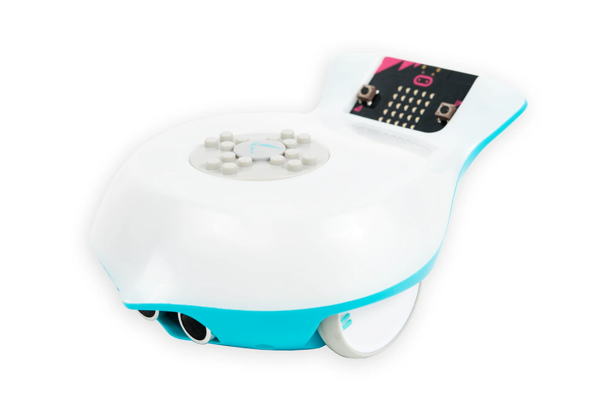

# Final Project: Finch Robot Challenges

## Essential Question
How can we apply object-oriented programming principles and Java concepts to create interactive, autonomous robot behaviors that solve real-world challenges?

## Project Overview
In this project-based learning experience, you will program a Finch 2.0 robot to perform one of three challenges:
1. Choreograph a dance routine (with movement, lights, and sound)
2. Create an artistic drawing using the robot's movements
3. Navigate a maze autonomously

Your program must demonstrate your understanding of Java programming concepts from APCSA and object-oriented design principles while creating an engaging robot behavior.

## Learning Objectives
- Apply Java programming concepts in a physical computing context
- Implement object-oriented design principles
- Develop problem-solving skills through algorithm development
- Create well-documented and maintainable code
- Practice technical communication through presentations and documentation

## Description of design choices
One of the first design choices I made was to use a while loop instead of coding the path step-by-step. This was mainly in order to utilize another Java concept we learned this year and to reduce redundancy and the amount of code I had to write. Another design choice is using nested conditionals because I wanted to wnsure the robot could check both sides of the maze to find the proper opening to pass through without having to manually write every turn statement in the method. I also added specific conditionals that are activated based on the number of moves forward the robot made in roder to make specific turns and move some ways forward for one of two reasons: The first reason is that some parts of the maze where the robot needs to turn a certain direction had both sides open, so the robot could turn right where it needs to turn left as that's the default option, resulting in specific left turn conditionals at certain points; the second reason is that the robot will sometimes run into walls or stick too far out to make a complete turn, which meant I had to add specific conditionals to move up a few centimeters to avoid the walls that the turns resulted in or successfully make turns.
## Challenges faced and solutions
The first challenged I faced was taking measurements of the maze to find how far to move up or when to turn. I wasn't able to take proper measurements because many others were also using the maze, so i had to conduct multiple initial test to refine the distances and timing. The second and most arduous problem was dealing with the thrashed terrain of the maze. There was a lot of dust, crumbs, fallen walls, and other debris in the way as a result from all of the use occuring within it. Similarly, the maze required very precise positiong of the robot to avoid it hitting walls or the perimeter simply based on its design. Unfortunately, the only way I could overcome this in the time limit I was given was to constantly run the program ove rand over again until the end was reached, which took around 3-4 hours of testing.
## Future enhancements
If I was given Summer Break to work on this program, I would add some sort of machine learning algorithm in order for the robot to learn and memorize the maze's layout to prevent having to constantly test the robot over and over again just to perfect the run. As such, another thing I would add is a method that will automatically detect and avoid certain obstacles apart from the main navigate() method, which would take the stress away of trying to search for the perfect starting position in certain mazes.
## Video or images of your robot in action (embedded or linked)
Click the picture to view:

